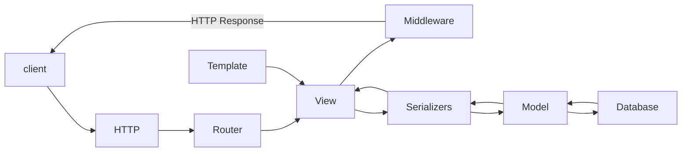

     
    <h1 align="center">Web service «TalentSpot»</h1>

### © ООО «TALENTSPOT»

TalentSpot — is an information service in the form of an online portal that connects qualified job seekers and employers to meet workforce needs, with the introduction of algorithms to automate the hiring process

> [!NOTE]\
> The project is still in the design phase.
> The service is being created with the support of a grant from <a href="https://fasie.ru/">the Foundation for Assistance to Innovations</a> under the
> Student Startup Program of the federal project <a href="https://univertechpred.ru/">«University Technological Entrepreneurship Platform»</a>
## Technology Stack

  

  

## Versions

apache + uwsgi

- Python version 3.12.0
- Django version 4.2.8
- Django rest framework version 3.14.0
- NodeJS version 18.12.1
- ReactJS version ^18.2.0
- Webpack version ^5.89.0

## Scheme of work

### © ООО «TALENTSPOT»

- Russian Federation
- Taxpayer Identification Number (INN) – 2623034058
- Tax Registration Reason Code (KPP) – 262301001
- Primary State Registration Number (PSRN) – 1232600016065
