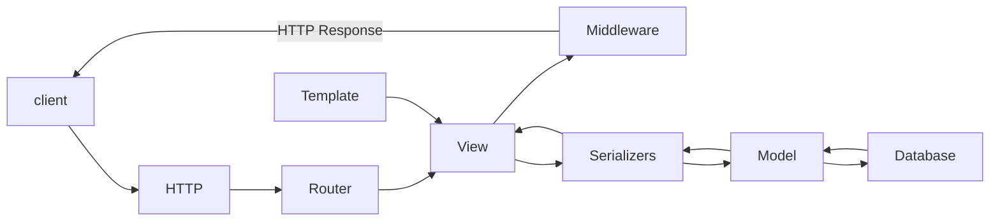

# Веб-сервис «TalentSpot»

apache + uwsgi

- Python version 3.12.0
- Django version 4.2.7
- Django rest framework version 3.14.0

```mermaid
graph LR;
    client-->HTTP
    HTTP-->Router
    Router-->View
    Template-->View
    View-->Middleware
    View-->Serializers
    Serializers-->View
    Serializers-->Model
    Model-->Serializers
    Model-->Database
    Database-->Model
    Middleware-->|HTTP Response| client 
```

### © ООО «ТалентСпот»
