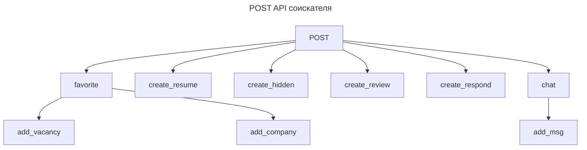
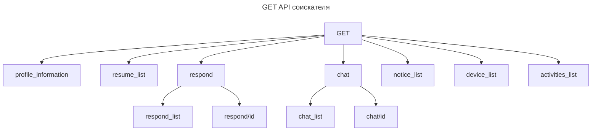
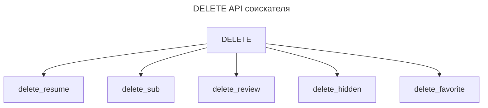
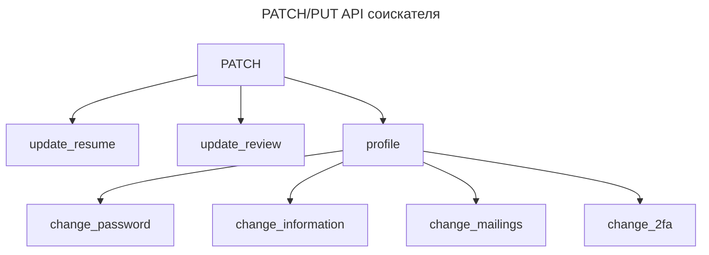

# API соискателя
### POST ЗАПРОСЫ

```mermaid
---
title: POST API соискателя
---
flowchart TD
    POST --> favorite
    favorite --> add_vacancy
    favorite --> add_company
    POST --> create_resume
    POST --> create_hidden
    POST --> create_review
    POST --> create_respond
    POST --> chat
    chat --> add_msg
```
### GET ЗАПРОСЫ

```mermaid
---
title: GET API соискателя
---
flowchart TD
    GET --> profile_information
    GET --> resume_list
    GET --> respond
    respond --> respond_list 
    respond --> respond/id
    GET --> chat
    GET --> notice_list
    GET --> device_list
    GET --> activities_list
    chat --> chat_list 
    chat --> chat/id
```
### DELETE ЗАПРОСЫ

```mermaid
---
title: DELETE API соискателя
---
flowchart TD
    DELETE --> delete_resume
    DELETE --> delete_sub
    DELETE --> delete_review
    DELETE --> delete_hidden
    DELETE --> delete_favorite
```
### PATCH/PUT ЗАПРОСЫ

```mermaid
---
title: PATCH/PUT API соискателя
---
flowchart TD
    PATCH --> update_resume
    PATCH --> update_review
    PATCH --> profile
    profile --> change_password
    profile --> change_information
    profile --> change_mailings
    profile --> change_2fa
```
