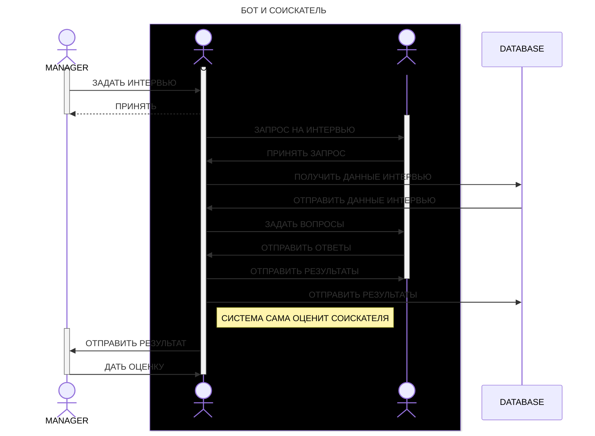

```mermaid
---
title: БОТ И СОИСКАТЕЛЬ
---
sequenceDiagram
    actor MANAGER
    box black
    actor BOT
    actor APPLICANT
    end
    activate BOT
    activate MANAGER
    MANAGER->>BOT: ЗАДАТЬ ИНТЕРВЬЮ
    BOT-->>MANAGER: ПРИНЯТЬ
    deactivate MANAGER
    activate APPLICANT
    BOT->>APPLICANT: ЗАПРОС НА ИНТЕРВЬЮ
    APPLICANT->>BOT: ПРИНЯТЬ ЗАПРОС
    BOT->>DATABASE: ПОЛУЧИТЬ ДАННЫЕ ИНТЕРВЬЮ
    DATABASE->>BOT: ОТПРАВИТЬ ДАННЫЕ ИНТЕРВЬЮ
    BOT->>APPLICANT: ЗАДАТЬ ВОПРОСЫ
    APPLICANT->>BOT: ОТПРАВИТЬ ОТВЕТЫ
    BOT->>APPLICANT: ОТПРАВИТЬ РЕЗУЛЬТАТЫ
    deactivate APPLICANT
    BOT->>DATABASE: ОТПРАВИТЬ РЕЗУЛЬТАТЫ
    Note right of BOT: СИСТЕМА САМА ОЦЕНИТ СОИСКАТЕЛЯ
    activate MANAGER
    BOT->>MANAGER: ОТПРАВИТЬ РЕЗУЛЬТАТ
    MANAGER->>BOT: ДАТЬ ОЦЕНКУ
    deactivate MANAGER
    deactivate BOT
```
